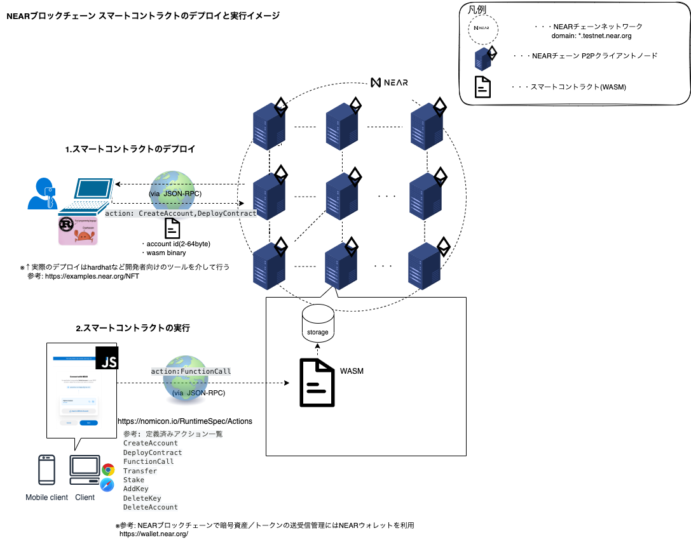

# README

## About

- My dApp template of NEAR Blockchain smart contract in Rust and frontend in Next.js(Typescript)

## Background

- [note - Rust/DApp実習 - はじめました](https://note.com/efujikawa/n/n67d8c5d5b868?magazine_key=m2b7793629425)
- [note - 最終日 - イーサリアム学ぶ夏休みのまとめ](https://note.com/efujikawa/n/n2f4f03ef03fd)
- [note - Rust学習まとめ - テスト作成に入門する、等／学習のふりかえり](https://note.com/efujikawa/n/n0d2aa27b6bc7)
- [note - ブロックチェーン自由研究 - NEARについて理解する](https://note.com/efujikawa/n/n1a6fbbb5d981?magazine_key=m970875a701ac)

## Environments

| Name | Version |
|:----:|:----:|
| `OS` | macOS 10.15.5(Intel)  | 
| NodeJs | 16.16.0  | 
| Rust | 1.62.1 |  
| Terraform | 1.2.7  | 
| Serverless Framework | 2.72.*  | 
| AWS-cli | 2.5.3  | 
| NextJs | 12.* |
| React | 18.* |
| Emotion/react | 11.* |

## Architecture Overview

[](architecture.drawio.svg)

## How to use

### Smart contract build and deploy

- Build

```
npm run build:contract
```

- Deploy SmartContract to testnet

```
npm run dev:deploy:contract
```

### Prepare Frontend(next.js) .env.local

- Open contracts/neardev/dev-account.env and check contract name

```
$ cat contracts/neardev/dev-account.env 
CONTRACT_NAME=dev-1660474152460-14596747053304
```

- Put .env.local file for next.js

```
touch .env.local
cat <<EOF frontend/.env.local
NEXT_PUBLIC_CONTRACT_NAME=dev-1660474152460-14596747053304
EOF
```

### Frontend(next.js) build 

- Build

```
npm run build:frontend
```

### Frontend(next.js) preview(local)

- Start Dev Frontend Server

```
npm run dev
```

### Frontend deploy(test)

- Ensure your serverless framework access key `$SERVERLESS_ACCESS_KEY` is exists
  - if does not exist.
    - login app.serverless.com and publish your access key
      - [access here](https://app.serverless.com/efgriver/settings/accessKeys)
        - don't forget to put secret(or ensure) environment variable on repo for test
          - [access here](https://github.com/Eigo-Mt-Fuji/awesome-rust-dapp/settings/environments/594355632/edit)

```
echo $SERVERLESS_ACCESS_KEY
```

- Execute serverless deploy

```
$ npm run deploy:serverless:test
```

- Ensure serverless deploy is done(messages should be shown like following)

```
> awesome-rust-dapp@0.1.0 deploy:serverless:test
> cp serverless.test.yml serverless.yml && components-v1 && rm -rf serverless.yml


  awesomeRustDapp: 
    appUrl:         https://awesome-rust-dapp.efgriver.com
    bucketName:     v2j8wjn-k5ncpd8
    distributionId: E1WHCQULHESL5I

  287s › awesomeRustDapp › done
```

### Unit test(rust)

```
npm run test:unit
```

### Integration test(next.js / cypress)

- start dev server

```
npm run dev
```

- open another terminal

- start integration test
  - after cypress launched successfully, choose E2E and run each test spec manually.

```
npm run test:integration:ts
```

### Deploy frontend app AWS(test)


```
NEXT_PUBLIC_CONTRACT_NAME=dev-1660474152460-14596747053304
SERVERLESS_ACCESS_KEY=my secret key
SLS_STAGE=test
```

- try deploy serverless deploy

```
export SERVERLESS_ACCESS_KEY=my secret key
source frontend/.env.local
npm run deploy:serverless
```

## Note: Directory Tree

- Main component in japanese
  - `dAppフロントエンドソースコード置き場(Next.js)`
  - `サーバレスインフラコード(Serverless Framework)`
  - `dAppバックエンドソースコード置き場(NEAR Smart Contract)`
  - `スマートコントラクト結合テストコード`
  - `E2Eテストコード(Cypress)`
  - `IaCコード(Terraform)`
  - `CI/CD設定(Github Actions Workflow)`
  - `サーバレスインフラコード(Serverless Framework)`

```
nextjs-neardev-rust-template

├── README.md
├── next-env.d.ts
├── next.config.js
├── package.json                      # ビルド・デプロイスクリプト(NPM script)
├── package-lock.json
├── tsconfig.json
├── src                               # dAppフロントエンドソースコード置き場(Next.js)
│   ├── components
│   │   └── Form.tsx
│   ├── near-env-config.ts
│   ├── near-init-contract.ts
│   ├── pages
│   │   ├── _app.tsx
│   │   ├── api
│   │   └── index.tsx
│   ├── public
│   │   ├── favicon.ico
│   │   └── vercel.svg
│   ├── styles
│   │   ├── Home.module.css
│   │   └── globals.css
│   └── types.ts
├── contracts                        # dAppバックエンドソースコード置き場(NEAR Smart Contract)
│   ├── Cargo.lock
│   ├── Cargo.toml
│   ├── integration-tests            # スマートコントラクト結合テストコード
│   │   └── rs
│   │       ├── Cargo.toml
│   │       └── src
│   │           └── tests.rs
│   ├── neardev
│   │   ├── dev-account
│   │   └── dev-account.env
│   ├── src
│   │   └── lib.rs
│   └── target
│       └── wasm32-unknown-unknown
├── cypress                          # E2Eテストコード(Cypress)
│   ├── downloads
│   ├── e2e
│   │   ├── index.d.ts
│   │   └── spec.cy.ts
│   ├── fixtures
│   │   └── example.json
│   └── support
│       ├── commands.ts
│       └── e2e.ts
├── cypress.config.js
├── terraform                       # IaCコード(Terraform)
│   └── components
│       └── backend
│           ├── README.md
│           ├── apply.sh
│           ├── iam.tf
│           ├── main.tf
│           ├── output.tf
│           ├── providers.tf
│           ├── templates
│           │   ├── github-workflow-assume-role-policy.json
│           │   └── github-workflow-iam-policy.json
│           ├── terraform.plan
│           └── variables.tf
├── .github
│   └── workflows                  # CI/CD設定(Github Actions Workflow)
│           ├── deploy-aws-serverless.yml
│           └── tests.yml
└── serverless.test.yml            # サーバレスインフラ設定(Serverless Framework)
```
